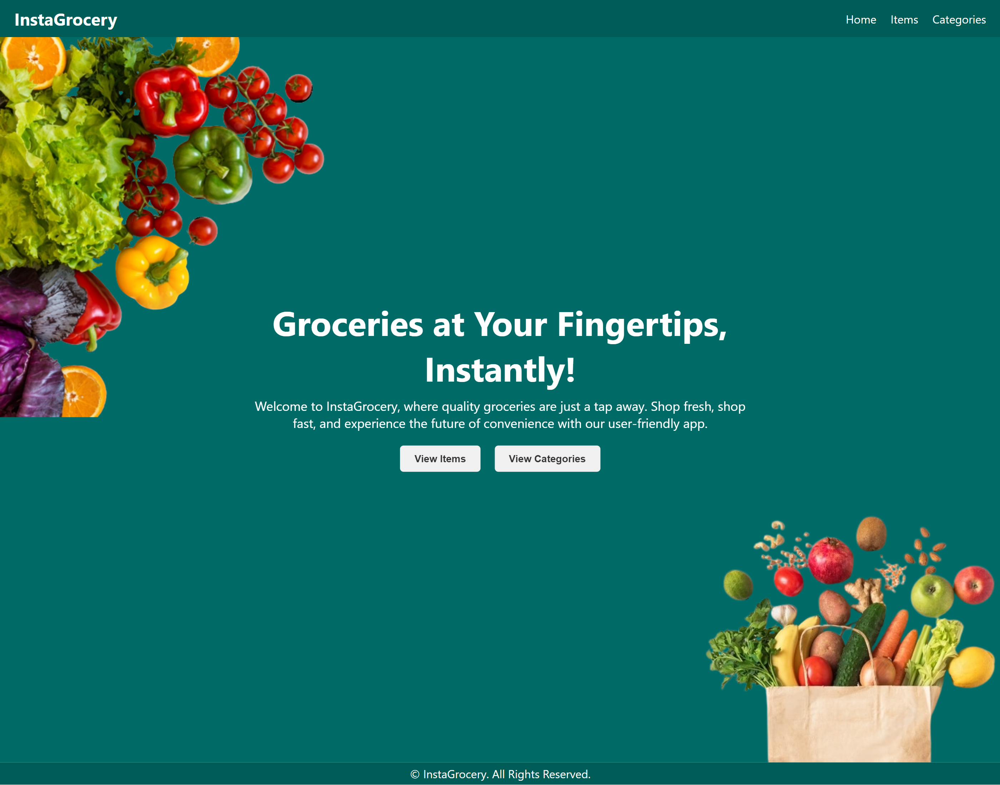
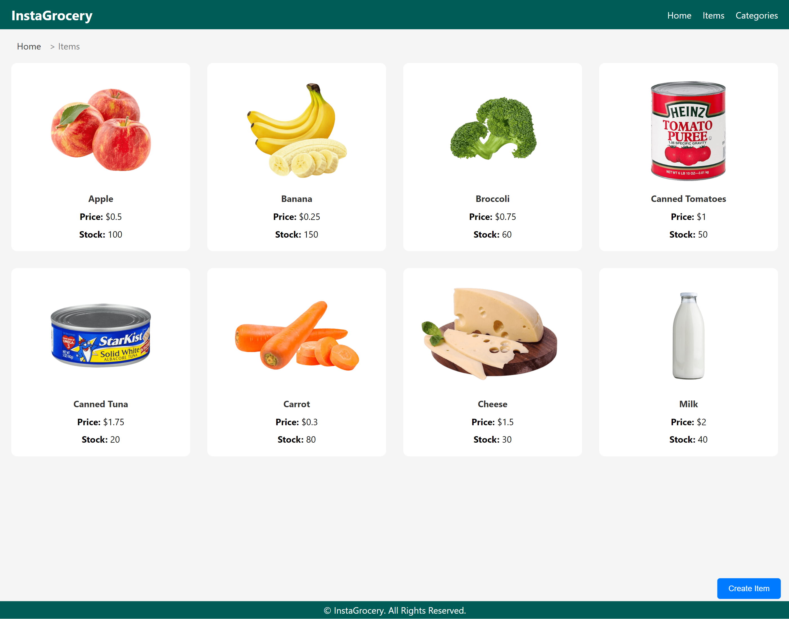
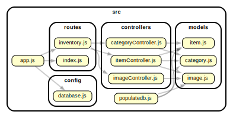

# InstaGrocery - Your Online Grocery Inventory

#### Visit InstaGrocery: [InstaGrocery Online](https://instagrocery.onrender.com)




## Description

InstaGrocery is your all-in-one online inventory application. Seamlessly perform CRUD (Create, Read, Update, Delete) operations on items and categories, and effortlessly upload images to enhance your inventory.

## Features

-   **Effortless Inventory Management**: Streamline the management of your inventory with easy-to-use CRUD operations for items and categories.

-   **Image Upload**: Enhance your inventory by uploading images for items, making it visually appealing and informative.

-   **User-Friendly Interface**: Navigate through the app effortlessly with an intuitive and user-friendly interface.

-   **Category Organization**: Organize your items into categories for a structured inventory layout.

## Dependency Graph



## Installation

1.  Clone the repository:

    ```bash
    git clone https://github.com/karprabha/inventory-application
    ```

2.  Navigate to the project directory:

    ```bash
    cd inventory-application
    ```

3.  Install dependencies:

    ```bash
    npm install
    ```

4.  Start the development server:
    ```bash
    npm run dev
    ```

## Technologies Used

-   "Node.js"
-   "Express.js"
-   "MongoDB"
-   "Pug"
-   "Multer"
-   "SCSS"

## Upcoming Features

We have exciting plans for the future, including:

-   **User Authentication**: Create user accounts to manage inventory, track changes, and secure data.
-   **Reports and Analytics**: Implement reporting and analytics features to gain insights into inventory trends.
-   **Notification System**: Set up a notification system for low stock levels and important inventory updates.

## Credits

This project wouldn't have been possible without the contributions of various resources and individuals:

-   **Unsplash**: We're grateful to [Unsplash](https://unsplash.com/) for providing high-quality images, icons, and wallpapers that enhance the visual appeal of our inventory-application.
-   **Freepick.com**: Special thanks to [Freepik](https://www.freepik.com/) for the wonderful images

Please note that the resources used in this project are for educational and demonstration purposes only. This project is not intended for commercial use or distribution. We do not intend to sell, profit from, or violate any copyrights or licenses associated with these resources. We sincerely appreciate the contributions of these resources and their creators.

We extend our heartfelt thanks to each of these resources and their creators for enhancing the quality and aesthetics of our InstaGrocery inventory-application. Your contributions have made this project truly special!
